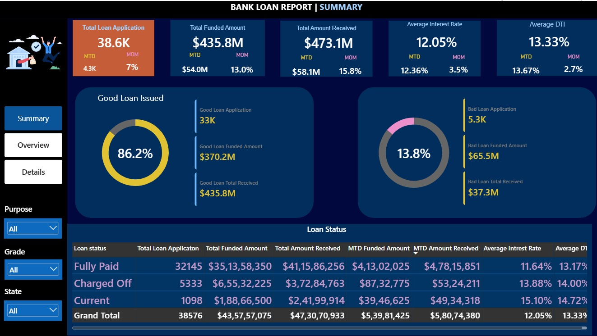
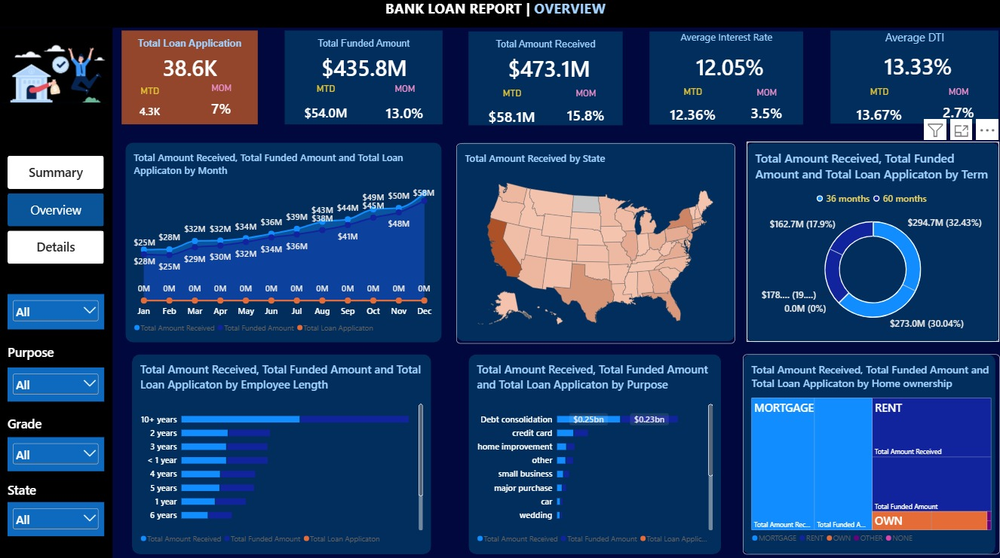
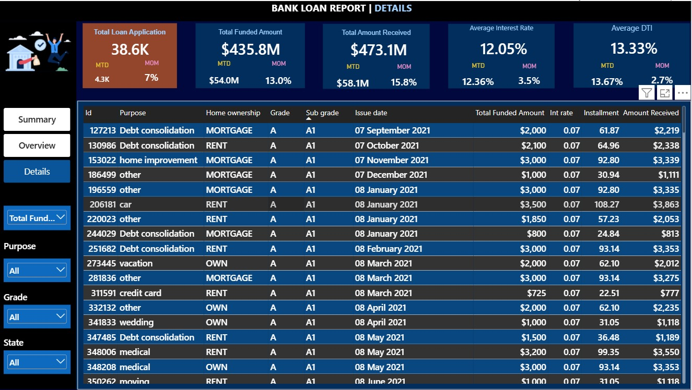

# 🏦 Bank Loan Analysis Dashboard

An interactive **Bank Loan Analysis** project built using **Power BI, SQL, DAX and Power Query** to analyze loan applications, funded amounts, repayments, loan performance and borrower characteristics.

---

## 📌 Project Overview

The objective of this project is to build an interactive analytical dashboard for monitoring and understanding a bank's loan portfolio.

The dashboard provides insights into:

- Loan applications
- Total funded amount
- Total amount received
- Average interest rate
- Average Debt-to-Income (DTI) ratio
- Good Loans vs. Bad Loans
- Loan status
- Monthly loan trends
- State-wise loan distribution
- Loan purpose
- Borrower employment length
- Home ownership
- Loan term

The project combines **SQL-based data validation** with **Power BI visualization** to ensure that the numbers presented in the dashboard are accurate.

---

## 🎯 Business Problem

The bank needs a clear and interactive way to monitor its loan portfolio and understand loan performance.

The analysis focuses on questions such as:

- How many loan applications have been received?
- How much has been funded?
- How much has been received from borrowers?
- What is the average interest rate?
- What percentage of loans are Good Loans vs. Bad Loans?
- How is loan activity changing month over month?
- Which loan purposes have the highest number of applications?
- How are loans distributed across different states?
- How does borrower employment length relate to the loan portfolio?
- How does loan performance vary by loan status?

---

## 🛠️ Technical Stack

| Technology | Purpose |
|---|---|
| **Power BI** | Interactive dashboards and data visualization |
| **SQL Server** | Data analysis and validation |
| **DAX** | KPI and calculated measures |
| **Power Query** | Data cleaning and transformation |

---

# 📊 Key KPIs

The dashboard tracks the following key performance indicators:

- **Total Loan Applications**
- **Total Funded Amount**
- **Total Amount Received**
- **Average Interest Rate**
- **Average DTI**
- **Good Loan Percentage**
- **Bad Loan Percentage**
- **MTD Performance**
- **Month-over-Month (MoM) Changes**

SQL queries were used to independently calculate and validate these KPIs before presenting them in Power BI.

---

# 📈 Dashboard Overview

The Power BI report consists of three interactive dashboards connected through navigation buttons.

---

## 1️⃣ Summary Dashboard

The **Summary Dashboard** provides a high-level overview of the bank's loan portfolio.

### Key Features

- Total Loan Applications
- Total Funded Amount
- Total Amount Received
- Average Interest Rate
- Average DTI
- Good Loan vs. Bad Loan analysis
- Loan status analysis
- State-wise analysis
- Loan grade filtering
- Interactive slicers

### Dashboard



---

## 2️⃣ Overview Dashboard

The **Overview Dashboard** focuses on trends and deeper analysis of the loan portfolio.

### Key Analysis

- Monthly loan issue trends
- Loan distribution by employment length
- Loan distribution by purpose
- Borrower profiling
- State-wise analysis
- Loan term analysis
- Home ownership analysis

### Dashboard



---

## 3️⃣ Details Dashboard

The **Details Dashboard** provides a granular view of individual loan records.

It allows users to examine detailed information such as:

- Loan ID
- Loan purpose
- Home ownership
- Loan grade
- Sub-grade
- Issue date
- Funded amount
- Interest rate
- Installment
- Amount received

### Dashboard



---

# 🧮 SQL Analysis & Validation

SQL played an important role in this project.

The SQL queries were used to **cross-check and validate the values displayed in the Power BI dashboards**.

The analysis includes:

### KPI Validation

- Total loan applications
- MTD loan applications
- PMTD loan applications
- Total funded amount
- MTD funded amount
- PMTD funded amount
- Total amount received
- MTD amount received
- PMTD amount received
- Average interest rate
- Average DTI

### Good Loan Analysis

- Good Loan Percentage
- Good Loan Applications
- Good Loan Funded Amount
- Good Loan Amount Received

### Bad Loan Analysis

- Bad Loan Percentage
- Bad Loan Applications
- Bad Loan Funded Amount
- Bad Loan Amount Received

### Loan Status Analysis

Loan status was analyzed using:

- Loan count
- Total amount received
- Total funded amount
- Interest rate
- DTI

SQL was also used to validate MTD values by loan status.

---

# 📊 Overview Analysis Using SQL

The SQL analysis also covers:

- Monthly loan applications and amounts
- State-wise loan performance
- Loan term analysis
- Employee length analysis
- Loan purpose analysis
- Home ownership analysis

The project also demonstrates **filter validation**. For example, when the Grade A filter is selected in the dashboard, the corresponding SQL query can be modified using `WHERE grade = 'A'` to cross-check the dashboard results.

---

# 📐 DAX & Data Modeling

DAX was used to create calculated measures and KPIs required for the interactive Power BI dashboards.

The project includes analysis for:

- Total applications
- Funded amount
- Amount received
- Average interest rate
- Average DTI
- Good Loan percentage
- Bad Loan percentage
- MTD calculations
- PMTD calculations
- MoM analysis

Data modeling was used to support interactive filtering and dashboard analysis.

---

# 🎨 Dashboard & UI Features

The dashboards include:

- Interactive slicers
- KPI cards
- Dynamic calculations
- Interactive charts
- Drill-down analysis
- Dashboard navigation buttons
- Summary / Overview / Details navigation
- Dynamic button highlighting
- Loan grade filtering
- Good Loan / Bad Loan filtering
- State-wise analysis

---

# 🔄 Project Workflow

```text
Raw Loan Data
      ↓
Data Cleaning & Transformation
      ↓
SQL Analysis & Validation
      ↓
Data Modeling
      ↓
DAX Measures
      ↓
Power BI Visualization
      ↓
Interactive Dashboards
      ↓
Business Analysis
